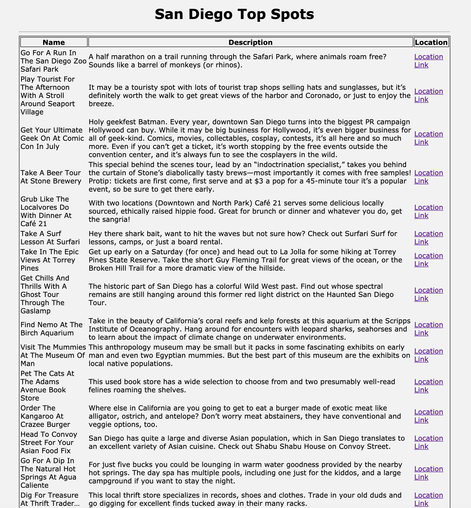

# WEB102-San-Diego-Top-Spots

Third project in my time at San Diego Code School, this one integrates a data.json file into a table
through jquery and javascript. Added some minimal styling with sass and a local express server later
on.

Please feel free to demo the project by taking these steps.. 

1. Clone or fork the repo 
2. $ npm install 
3. $ npm start (which will build and run on local server 3000)
4. Open up your browser to view on localhost 3000

Thank you, Miles Mickelson
